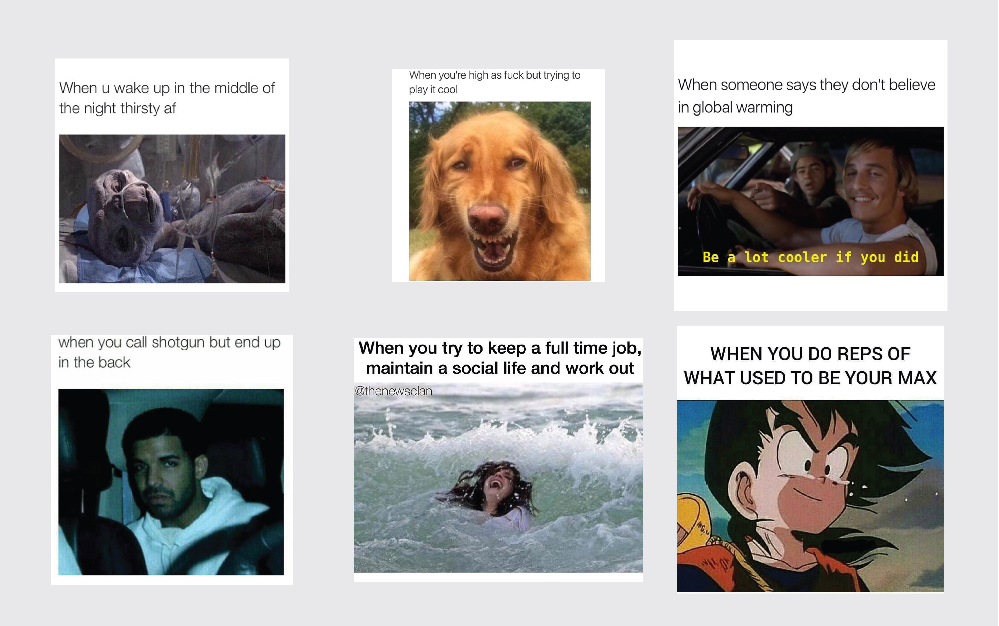
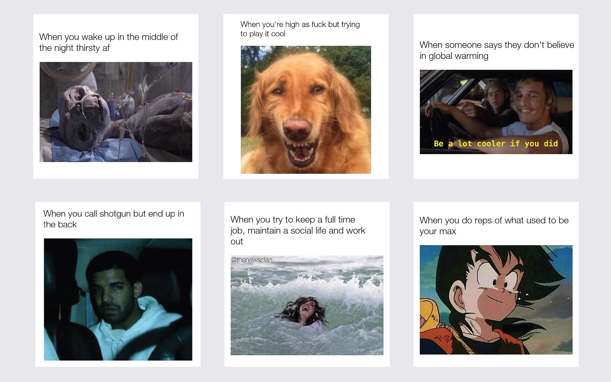
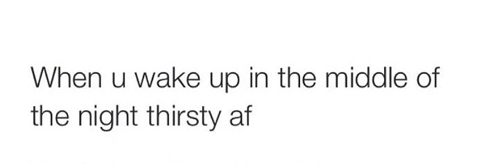
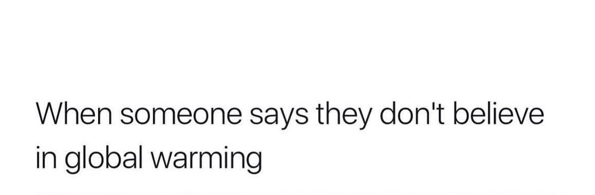
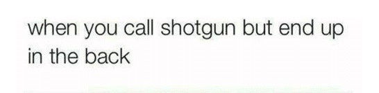
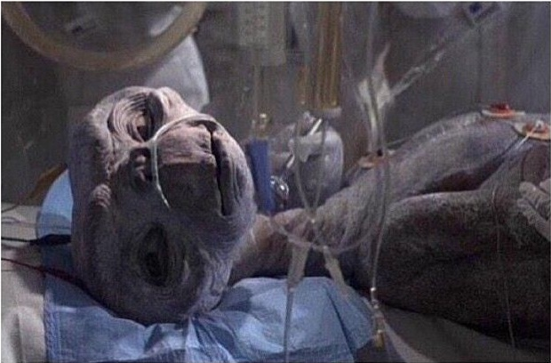
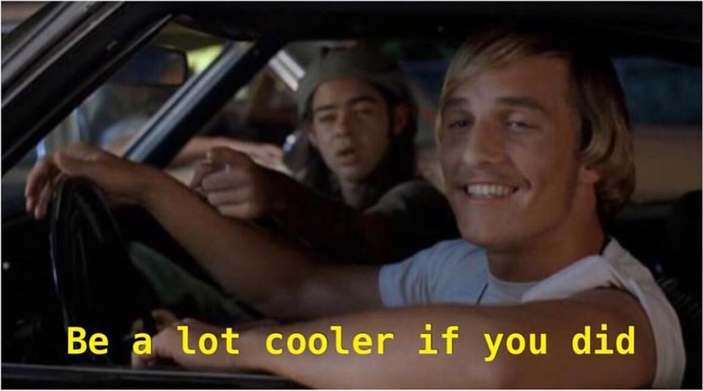
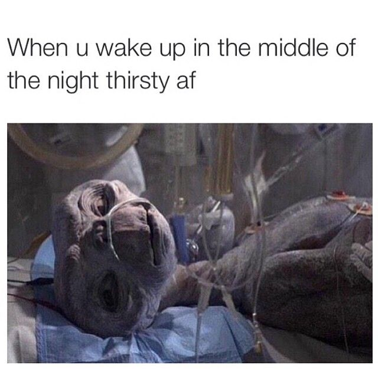
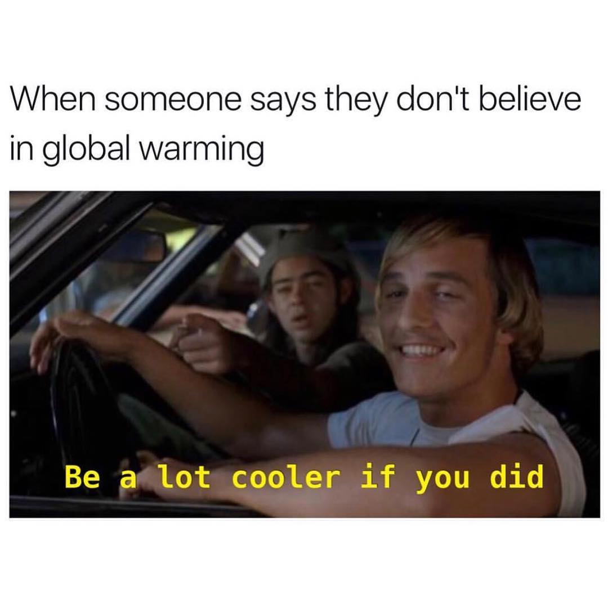
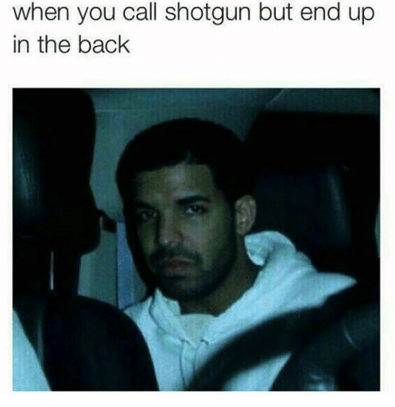

# meme-recycler

Reformats a directory of memes.

This project uses code from three previous projects:

1. [meme-cropper](https://github.com/evmarts/meme-cropper) to partition input memes into two images; an image of the text and a meme pic image.
2. [meme-text-ocr](https://github.com/evmarts/meme-text-ocr) to recognize the text from the image of text as a string.
3. [meme-maker](https://github.com/evmarts/meme-maker) to create a meme.

### Motivation:

Memes can come in all shapes and sizes: 

But sometimes it is nice to keep a simple format:

### meme-recycler.py

1.
Crops the meme into its two components:

~~~
$ python meme-recycler.py
Cropping images...
cropped meme0.jpg
cropped meme1.jpg
cropped meme2.jpg
~~~

text components:

pic components:

2.
Reconizes the text component as a string:

~~~
Applying OCR on images of text...
Got text of meme0_text.jpg
Got text of meme1_text.jpg
Got text of meme2_text.jpg
~~~

3.
Creates new memes:

~~~
Constructing images...
Created new meme image: meme0.jpg
Created new meme image: meme1.jpg
Created new meme image: meme2.jpg
~~~

output images:

