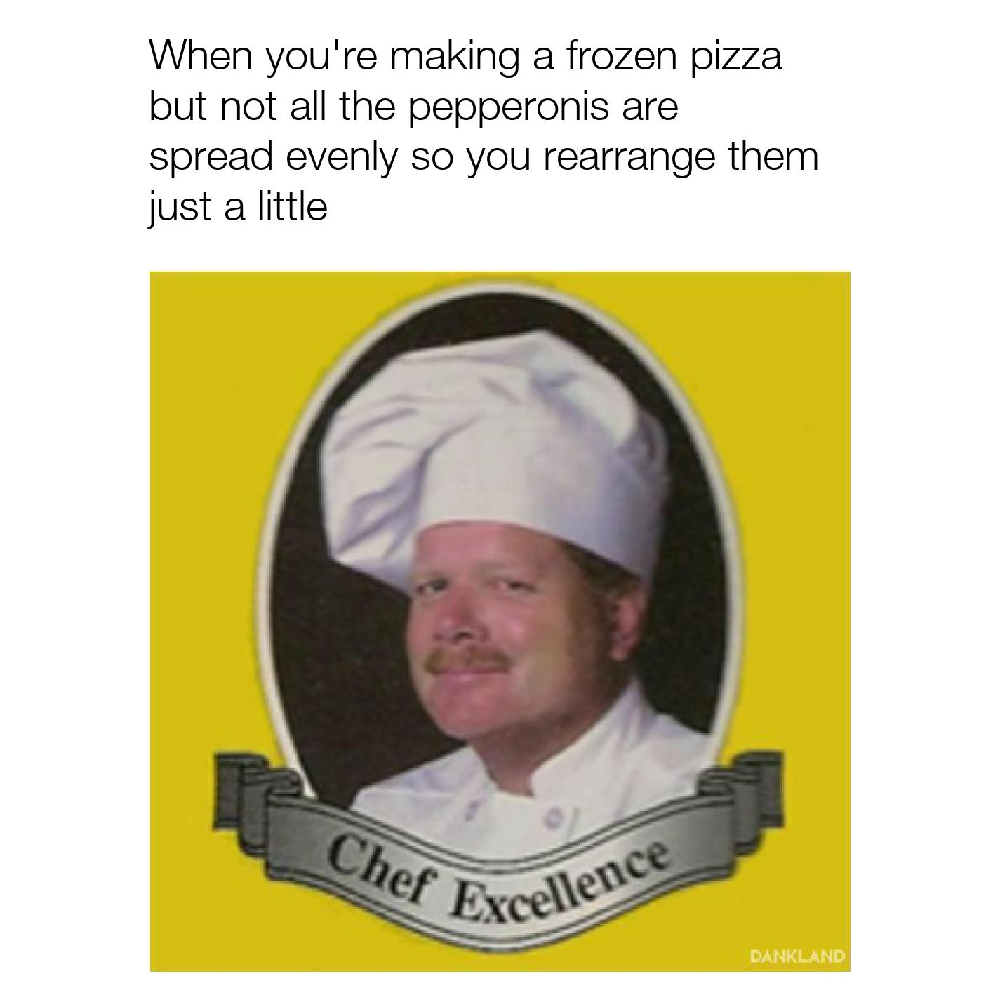

# meme-recycler

The goal of this project is to take an image of meme and output a reformatted image of same the meme. 

## Notes

This project combines the functionality of three other projects of mine: 

1. [Recognizing Text from Memes](https://evmarts.github.io/blog/2017/07/26/meme-text-ocr/)

2. [Partitioning Twitter Memes](https://evmarts.github.io/blog/2017/08/12/meme-cropper/)

3. [Automated Twitter Memes](https://evmarts.github.io/blog/2017/08/03/meme-maker/)

## Motivation:

Suppose we have downloaded some memes: 


Notice how the format of these memes are slightly different. The spacing, font and positioning of the text varies.

Suppose we want to repost these memes on our own page. If we are picky about the formatting of our memes and we want all our memes to follow the same format, then the memes above would be unacceptable. So we decide to reformat them before posting.

This was the case for me when I would repost memes to my accounts, I would have to go through the following steps:

1. Crop the image down to the central image, i.e., crop out the text and whitespace. 
2. Open Twitter and compose a tweet with the text of the original meme and the cropped down image as the attachment.
3. Take a screenshot of the Tweet
4. Crop the screenshot down to a square containing the newly formatted meme. 

If I were to go through these steps with the images above, I would have created the following images: 



This process of taking a screenshot of your tweet gives us a common format, but the steps are painfully mechanical and it just takes a long time. We want to automate this process.

Notice that to automate this process we would need to do three things:

1. Recognize the text of the meme as a string.
2. Crop the meme down to the central image and store it. 
3. Take the string and stored image and format in such a way that resembles a Twitter meme. 

If we had programs to perform each one of those steps then we could automate this process and save a lot of time. 

## Getting Started

Install [tesseract](https://github.com/tesseract-ocr/tesseract/wiki).

Install [OpenCV](https://opencv.org/). I followed [this guide](https://www.pyimagesearch.com/2016/12/19/install-opencv-3-on-macos-with-homebrew-the-easy-way/). 

Clone:
```git clone https://github.com/evmarts/meme-recycler.git```

Run the script:
```python meme-recycler.py```

## Examples

Suppose we wanted to reformat the following memes:


With these images in the ```in/``` directory, we can run the Python script.

The program first runs code from  ```meme-cropper.py``` to partition each image into two images:

~~~
evmarts$ python meme-recycler.py
Cropping images...
cropped sample0.jpg
cropped sample1.jpg
cropped sample2.jpg
cropped sample3.jpg
cropped sample4.jpg
cropped sample5.jpg
~~~


then runs code from ```meme-text-ocr``` to apply optical character recognition to the images of text shown above.

~~~
Applying OCR on images of text...
Got text of sample0_text.jpg
Got text of sample1_text.jpg
Got text of sample2_text.jpg
Got text of sample3_text.jpg
Got text of sample4_text.jpg
Got text of sample5_text.jpg
~~~

```when you bring your own bag to the grocery store```,   
```When your customizable character is in a cutscene```,   
```when you're making a frozen pizza but not all the pepperonis are spready evenly so you rearrange them just a litte```,  
```When your parents pick you up early from school```,   
```When you call shotgun but end up in the back```,   
```When you successfully heat up a frozen pizza without burning down the house```

and finally runs code from ```meme-maker.py``` to format the string of text and cropped-down image into the new versions of the memes.

~~~
Constructing images...
Created new meme image: sample0.jpg
Created new meme image: sample1.jpg
Created new meme image: sample2.jpg
Created new meme image: sample3.jpg
Created new meme image: sample4.jpg
Created new meme image: sample5.jpg
Done!
~~~

The new memes are then stored in the ```out/``` directory:


## Authors

* Evan James Martin

## Acknowledgments

Adrian Rosebrock, [Building a Pokedex in Python: Finding the Game Boy Screen (Step 4 of 6)](https://www.pyimagesearch.com/2014/04/21/building-pokedex-python-finding-game-boy-screen-step-4-6/)
